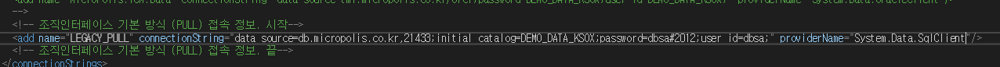
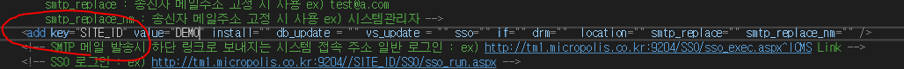

# 1. web.config에서 바꿔야 할 것.



* name = "LEGACY_PULL" => 각 고객사 고유 site_id로 변경(Enumerator.cs파일에서 검색.)
* providerName="System.Data.SqlClient" => 고객사별 사용하는 DB에 맞는 커넥터로 변경
  (mssql : System.Data.SqlClient, mysql :MySql.Data.MySqlClient )

# 2. configuration.xml에서 바꿔야 할 것.



* add key="SITE_ID" => 고객사별 고유 site_id로 변경(Enumerator.cs파일에서 검색.)

# 3. COM111.aspx.cs에러 
* 클래스명을 못찾는 상황임
* 디버깅 필요
```java
//인터페이스 테스트(19.07.09)
string className = string.Format("MicroPolisSln.ICM.KSOX.Interface.Interface.Bizi.BIZI_{0}, MicroPolisSln.ICM.KSOX.Interface", this.CurrentSession.SiteId); //브레이킹 포인트 걸기 
Type type = Type.GetType(className);

if (type == null)
type = Type.GetType("MicroPolisSln.ICM.KSOX.Interface.Interface.Bizi.BIZI_Base, MicroPolisSln.ICM.KSOX.Interface");

object obj = Activator.CreateInstance(type);//브레이킹 포인트 걸기
```
* 'string className =' 부분과, 'Object obj =' 부분에 브레이킹 포인트 건다
* 직접실행 창에서 this.CurrentSession.SiteId = "고객사 사이트 아이디"를 넣어주고 에러를 확인한다.


